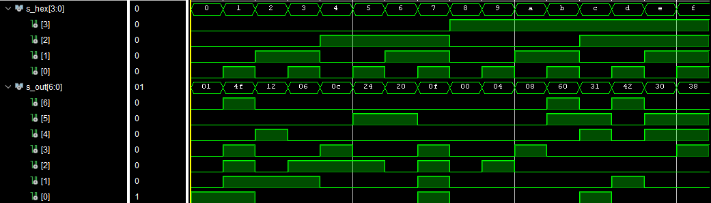
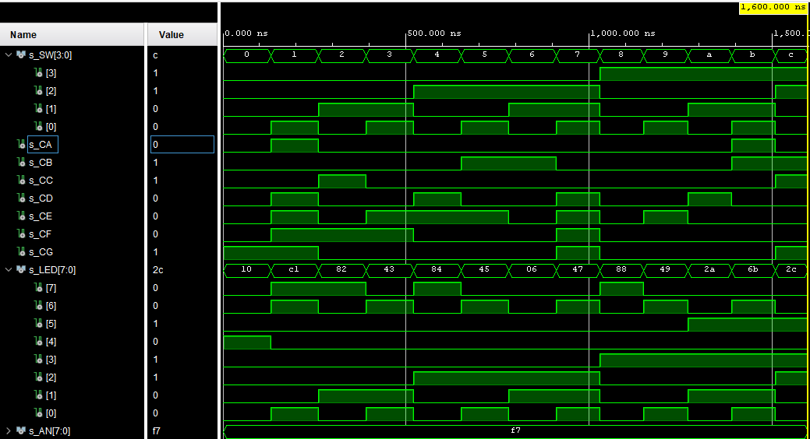

# H1 Digital-electronics-1 
## 04-segment


| **port** | **=>** | **pin** |
| :-: | :-: | :-: |
| CA | => | T10 |
| CB | => | R10 |
| CC | => | K16 |
| CD | => | K13 | 
| CE | => | P15 |
| CF | => | T11 |
| CG | => | L18 |
| AN[0] | => | J17 |
| AN[1] | => | J18 |
| AN[2] | => | T9 |
| AN[3] | => | J14 | 
| AN[4] | => | P14 |
| AN[5] | => | T14 |
| AN[6] | => | K2 |
| AN[7] | => | U13 |


| **Hex** | **Inputs** | **A** | **B** | **C** | **D** | **E** | **F** | **G** |
| :-: | :-: | :-: | :-: | :-: | :-: | :-: | :-: | :-: |
| 0 | 0000 | 0 | 0 | 0 | 0 | 0 | 0 | 1 |
| 1 | 0001 | 1 | 0 | 0 | 1 | 1 | 1 | 1 |
| 2 | 0010 | 0 | 0 | 1 | 0 | 0 | 1 | 0 |
| 3 | 0011 | 0 | 0 | 0 | 0 | 1 | 1 | 0 |
| 4 | 0100 | 1 | 0 | 0 | 1 | 1 | 0 | 0 |
| 5 | 0101 | 0 | 1 | 0 | 0 | 1 | 0 | 0 |
| 6 | 0110 | 0 | 1 | 0 | 0 | 0 | 0 | 0 |
| 7 | 0111 | 0 | 0 | 1 | 1 | 1 | 1 | 1 |
| 8 | 1000 | 0 | 0 | 0 | 0 | 0 | 0 | 0 |
| 9 | 1001 | 0 | 0 | 0 | 0 | 1 | 0 | 0 |
| A | 1010 | 0 | 0 | 0 | 1 | 0 | 0 | 0 |
| b | 1011 | 1 | 1 | 0 | 0 | 0 | 0 | 0 |
| C | 1100 | 0 | 1 | 1 | 0 | 0 | 0 | 1 |
| d | 1101 | 1 | 0 | 0 | 0 | 0 | 1 | 0 |
| E | 1110 | 0 | 1 | 1 | 0 | 0 | 0 | 0 |
| F | 1111 | 0 | 1 | 1 | 1 | 0 | 0 | 0 |


````vhdl
p_7seg_decoder : process(hex_i)
    begin
        case hex_i is
            when "0000" =>
                seg_o <= "0000001";     -- 0 
            when "0001" =>
                seg_o <= "1001111";     -- 1
            when "0010" =>
                seg_o <= "0010010";     -- 2
            when "0011" =>
                seg_o <= "0000110";     -- 3
            when "0100" =>
                seg_o <= "0001100";     -- 4
            when "0101" =>
                seg_o <= "0100100";     -- 5
            when "0110" =>
                seg_o <= "0100000";     -- 6
            when "0111" =>
                seg_o <= "0001111";     -- 7
            when "1000" =>
                seg_o <= "0000000";     -- 8
            when "1001" =>
                seg_o <= "0000100";     -- 9
            when "1010" =>
                seg_o <= "0001000";     -- A
            when "1011" =>
                seg_o <= "1100000";     -- B
            when "1100" =>
                seg_o <= "0110001";     -- C
            when "1101" =>
                seg_o <= "1000010";     -- D
            when "1110" =>
                seg_o <= "0110000";     -- E
            when others =>
                seg_o <= "0111000";     -- F
        end case;
    end process p_7seg_decoder;
````

````vhdl
p_stimulus : process
    begin
        report "Stimulus process started" severity note;
        s_hex <= "0000";wait for 100 ns; --0
        s_hex <= "0001";wait for 100 ns; --1
        s_hex <= "0010";wait for 100 ns; --2
        s_hex <= "0011";wait for 100 ns; --3
        s_hex <= "0100";wait for 100 ns; --4
        s_hex <= "0101";wait for 100 ns; --5
        s_hex <= "0110";wait for 100 ns; --6
        s_hex <= "0111";wait for 100 ns; --7
        s_hex <= "1000";wait for 100 ns; --8
        s_hex <= "1001";wait for 100 ns; --9
        s_hex <= "1010";wait for 100 ns; --A
        s_hex <= "1011";wait for 100 ns; --B
        s_hex <= "1100";wait for 100 ns; --C
        s_hex <= "1101";wait for 100 ns; --D
        s_hex <= "1110";wait for 100 ns; --E
        s_hex <= "1111";wait for 100 ns; --F

        report "Stimulus process finished" severity note;
        wait;
        

    end process p_stimulus;
````




````vhdl
hex2seg : entity work.hex_7seg
        port map(
            hex_i    => SW,
            seg_o(6) => CA,

            -- WRITE YOUR CODE HERE
            seg_o(5) => CB,
            seg_o(4) => CC,
            seg_o(3) => CD,
            seg_o(2) => CE,
            seg_o(1) => CF,
            seg_o(0) => CG
        );
````

| **Hex** | **Inputs** | **LED4** | **LED5** | **LED6** | **LED7** |
| :-: | :-: | :-: | :-: | :-: | :-: |
| 0 | 0000 | 1 | 0 | 0 | 0 |
| 1 | 0001 | 0 | 0 | 1 | 1 |
| 2 | 0010 | 0 | 0 | 0 | 1 |
| 3 | 0011 | 0 | 0 | 1 | 0 |
| 4 | 0100 | 0 | 0 | 0 | 1 |
| 5 | 0101 | 0 | 0 | 1 | 0 |
| 6 | 0110 | 0 | 0 | 0 | 0 |
| 7 | 0111 | 0 | 0 | 1 | 0 |
| 8 | 1000 | 0 | 0 | 0 | 1 |
| 9 | 1001 | 0 | 0 | 1 | 0 |
| A | 1010 | 0 | 1 | 0 | 0 |
| b | 1011 | 0 | 1 | 1 | 0 |
| C | 1100 | 0 | 1 | 0 | 0 |
| d | 1101 | 0 | 1 | 1 | 0 |
| E | 1110 | 0 | 1 | 0 | 0 |
| F | 1111 | 0 | 1 | 1 | 0 |

````vhdl
-- Connect one common anode to 3.3V
    AN <= b"1111_0111";

    -- Display input value on LEDs
    LED(3 downto 0) <= SW;
    
    -- LED(7:4) indicators
    -- Turn LED(4) on if input value is equal to 0, ie "0000"

    LED(4) <= '1' when (SW = "0000") else '0';
 
    -- Turn LED(5) on if input value is greater than 9
    LED(5) <= 
        '1' when SW = "1010" else    --a
        '1' when SW = "1011" else    --b
        '1' when SW = "1100" else    --c
        '1' when SW = "1101" else    --d
        '1' when SW = "1110" else    --e
        '1' when SW = "1111" else    --f
        '0';

    -- Turn LED(6) on if input value is odd, ie 1, 3, 5, ...
    LED(6) <= 
         '1' when SW(0) = '1' else
         '0';


    -- Turn LED(7) on if input value is a power of two, ie 1, 2, 4, or 8
    LED(7) <=
         '1' when (SW = "0001") else  --1
         '1' when (SW = "0010") else  --2
         '1' when (SW = "0100") else  --4
         '1' when (SW = "1000") else  --8
         '0';
````


