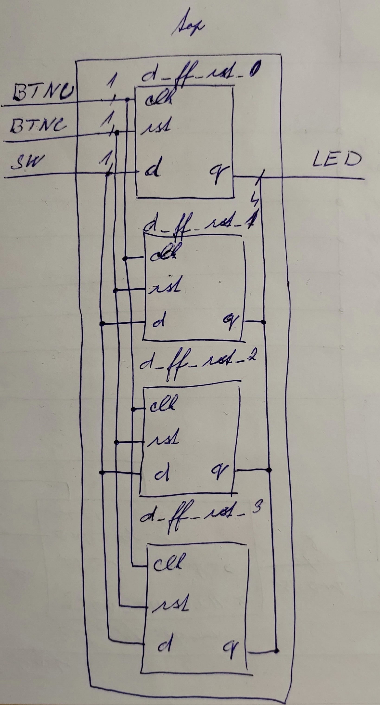

# H1 Digital-electronics-1 
## 07-flip_flops
## 1. Přírava


   | **clk** | **d** | **q(n)** | **q(n+1)** | **Comments** |
   | :-: | :-: | :-: | :-: | :-: |
   | ^ | 0 | 0 | 0 | No Change |
   | ^ | 0 | 1 | 0 | Set |
   | ^ | 1 | 0 | 1 | No Change |
   | ^ | 1 | 1 | 1 | Set |
   


   | **clk** | **j** | **k** | **q(n)** | **q(n+1)** | **Comments** |
   | :-: | :-: | :-: | :-: | :-: | :-- |
   | ^ | 0 | 0 | 0 | 0 | No change |
   | ^ | 0 | 0 | 1 | 1 | No change |
   | ^ | 0 | 1 | 0 | 0 | Reset |
   | ^ | 0 | 1 | 1 | 0 | Reset |
   | ^ | 1 | 0 | 0 | 1 | Set |
   | ^ | 1 | 0 | 1 | 1 | Set |
   | ^ | 1 | 1 | 0 | 1 | Toggle |
   | ^ | 1 | 1 | 1 | 0 | Toggle |
   


   | **clk** | **t** | **q(n)** | **q(n+1)** | **Comments** |
   | :-: | :-: | :-: | :-: | :-- |
   | ^ | 0 | 0 | 0 | 1 | No Change |
   | ^ | 0 | 1 | 1 | 0 | No Change |
   | ^ | 1 | 0 | 1 | 0 | Invert |
   | ^ | 1 | 1 | 0 | 1 | Invert |
   
## 2. D-Latch 
````vhdl
p_d_latch : process (d, arst, en)
    begin
        if(arst = '1') then
            q     <= '0';
            q_bar <= '1';
        elsif(en = '1') then
            q     <= d;
            q_bar <= not d;   
        end if;     
    end process p_d_latch;
````
````vhdl
p_reset_gen : process
    begin
        s_arst <= '0';
        wait for 38 ns;
        
        --Reset on
        s_arst <= '1';
        wait for 53ns;
        
        --Reset off
        s_arst <= '0';  
        wait for 300ns;
        s_arst <= '1';
        
        wait;     
    end process p_reset_gen;
    
    p_stimulus : process
    begin
        report "Stimulus process started" severity note;
        s_d <= '0';
        s_en <= '0';
        
        assert (s_q = '0')
        report "asdasd" severity note;
        
        --d sekv
        wait for 10ns;
        s_d <= '1';
        wait for 10ns;
        s_d <= '0';
        wait for 10ns;
        s_d <= '1';
        wait for 10ns;
        s_d <= '0';
        wait for 10ns;
        s_d <= '1';
        wait for 10ns;
        s_d <= '0';
        
        assert (s_q = '0' and s_q_bar = '1')
        report "asdasd" severity note;
        
        s_en <= '1';
        --d sekv
        wait for 10ns;
        s_d <= '1';
        wait for 10ns;
        s_d <= '0';
        wait for 10ns;
        s_d <= '1';
        wait for 10ns;
        s_d <= '0';
        wait for 10ns;
        s_en <= '0';  --en=0
        wait for 200ns;
        s_d <= '0';

        
        --d sekv
        wait for 10ns;
        s_d <= '1';
        wait for 10ns;
        s_d <= '0';
        wait for 10ns;
        s_d <= '1';
        wait for 10ns;
        s_d <= '0';
        wait for 10ns;
        s_d <= '1';
        wait for 10ns;


    end process p_stimulus;
````


##3. D Flip-Flop asynchronní
````vhdl
p_d_ff_arst : process (clk, arst)
    begin 
        if(arst ='1')then
            q     <= '0';
            q_bar <= '1';
        elsif rising_edge(clk) then
            q     <= d;
            q_bar <= not d;
        end if;
    end process p_d_ff_arst;
````
````vhdl
p_clk_gen : process
    begin
        while now < 750 ns loop         -- 75 periods of 100MHz clock
            s_clk_100MHz <= '0';
            wait for c_CLK_100MHZ_PERIOD / 2;
            s_clk_100MHz <= '1';
            wait for c_CLK_100MHZ_PERIOD / 2;
        end loop;
        wait;
    end process p_clk_gen;

    p_reset_gen : process
    begin
        s_arst <= '0';
        wait for 28 ns;
        
        s_arst <= '1';
        wait for 13ns;
        
        s_arst <= '0'; 
        
        wait for 17 ns;
        s_arst <= '1'; 
             
        wait for 33ns;
        s_arst <= '0';
                     
        wait for 660 ns;        
        s_arst <= '1';

        wait;     
    end process p_reset_gen;
    p_stimulus : process
    begin
        report "Stimulus process started" severity note;
        s_d <= '0';
        
        --d sekv
        wait for 14ns;
        s_d <= '1';
        wait for 10ns;
        s_d <= '0';     
        wait for 6ns;
        --assert()
        --report "";
        wait for 4ns;
        s_d <= '1';
        wait for 10ns;
        s_d <= '0';
        wait for 10ns;
        s_d <= '1';
        wait for 10ns;
        s_d <= '0';
        wait for 10ns;
        s_d <= '1';
        wait for 10ns;
        s_d <= '0';
        --/d sekv
        

        --d sekv
        wait for 10ns;
        s_d <= '1';
        wait for 10ns;
        s_d <= '0';
        wait for 10ns;
        s_d <= '1';
        wait for 10ns;
        s_d <= '0';
        wait for 10ns;
        s_d <= '1';
        wait for 10ns;
        s_d <= '0';
        wait for 10ns;
        s_d <= '1';
        wait for 10ns;
        s_d <= '0';
        --/d sekv
        
        --d sekv
        wait for 10ns;
        s_d <= '1';
        wait for 10ns;
        s_d <= '0';
        wait for 10ns;
        s_d <= '1';
        wait for 10ns;
        s_d <= '0';
        wait for 10ns;
        s_d <= '1';
        wait for 10ns;
        s_d <= '0';
        wait for 10ns;
        s_d <= '1';
        wait for 10ns;
        s_d <= '0';
        --/d sekv
    end process p_stimulus;
````


##4. T Flip-Flop
````vhdl
p_t_ff_rst : process (clk)
    begin 
        if rising_edge(clk) then
            if(rst = '1')then
                s_q <= '0';        
            else
                if(t='0' and s_q='0') then
                    s_q <= s_q;
                elsif(t='0' and s_q='1') then
                    s_q <= s_q;
                elsif(t='1' and s_q='0') then
                    s_q <= not s_q;
                elsif(t='1' and s_q='1') then
                    s_q <= not s_q;
                end if;
            end if;
        end if;    
    end process p_t_ff_rst;
    q     <= s_q;
    q_bar <= not s_q;
````
````vhdl
uut_jk_ff_rst: entity work.t_ff_rst
    port map(
        clk => s_clk_100MHz,
        rst => s_rst,
        t => s_t,
        q => s_q,
        q_bar => s_q_bar
    );
   p_clk_gen : process
    begin
        while now < 750 ns loop         -- 75 periods of 100MHz clock
            s_clk_100MHz <= '0';
            wait for c_CLK_100MHZ_PERIOD / 2;
            s_clk_100MHz <= '1';
            wait for c_CLK_100MHZ_PERIOD / 2;
        end loop;
        wait;
    end process p_clk_gen;

    p_reset_gen : process
    begin
        s_rst <= '0';
        
        wait for 28 ns;
        s_rst <= '1';
        
        wait for 14ns;
        s_rst <= '0';  
        
        wait for 37 ns;
        s_rst <= '1';
        
        wait for 33 ns;
        s_rst <= '0';
        
        wait for 300ns;
        s_rst <= '1';
        wait;     
    end process p_reset_gen;
    p_stimulus : process
    begin
        report "Stimulus process started" severity note;
        s_t <= '0';
        wait for 40 ns;
        s_t <= '1';
        wait for 7 ns;
        s_t <= '0';
        wait for 20 ns;
        s_t <= '1';
        report "Stimulus process finished" severity note;
        wait;
    end process p_stimulus; 
````


##5. D Flip-Flop

````vhdl
p_d_ff_rst : process (clk)
    begin 
        if rising_edge(clk) then
            if(rst ='1')then
                q     <= '0';
                q_bar <= '1';
            elsif rising_edge(clk) then
                q     <= d;
                q_bar <= not d;
            end if;
        end if;
    end process p_d_ff_rst;
````
````vhdl
 p_clk_gen : process
    begin
        while now < 750 ns loop         -- 75 periods of 100MHz clock
            s_clk_100MHz <= '0';
            wait for c_CLK_100MHZ_PERIOD / 2;
            s_clk_100MHz <= '1';
            wait for c_CLK_100MHZ_PERIOD / 2;
        end loop;
        wait;
    end process p_clk_gen;

    p_reset_gen : process
    begin
        s_rst <= '0';
        wait for 28 ns;
        
        s_rst <= '1';
        wait for 13ns;
        
        s_rst <= '0'; 
        
        wait for 17 ns;
        s_rst <= '1'; 
             
        wait for 33ns;
        s_rst <= '0';
                     
        wait for 660 ns;        
        s_rst <= '1';

        wait;     
    end process p_reset_gen;
    p_stimulus : process
    begin
        report "Stimulus process started" severity note;
        s_d <= '0';
        
        --d sekv
        wait for 14ns;
        s_d <= '1';
        wait for 10ns;
        s_d <= '0';     
        wait for 6ns;
        --assert()
        --report "";
        wait for 4ns;
        s_d <= '1';
        wait for 10ns;
        s_d <= '0';
        wait for 10ns;
        s_d <= '1';
        wait for 10ns;
        s_d <= '0';
        wait for 10ns;
        s_d <= '1';
        wait for 10ns;
        s_d <= '0';
        --/d sekv
        

        --d sekv
        wait for 10ns;
        s_d <= '1';
        wait for 20ns;
        s_d <= '0';       
    end process p_stimulus; 
````


## 6. JK Flip-Flop
````vhdl
p_jk_ff_rst : process (clk)
    begin 
        if rising_edge(clk) then
            if(rst = '1')then
                s_q <= '0';        
            else
                if(j='0' and k='0') then
                    s_q <= s_q;
                elsif(j='0' and k='1') then
                    s_q <= '0';
                elsif(j='1' and k='0') then
                    s_q <= '1';
                elsif(j='1' and k='1') then
                    s_q <= not s_q;
                end if;
            end if;
        end if;    
    end process p_jk_ff_rst;
    q     <= s_q;
    q_bar <= not s_q;
````
````vhdl
p_clk_gen : process
    begin
        while now < 750 ns loop         -- 75 periods of 100MHz clock
            s_clk_100MHz <= '0';
            wait for c_CLK_100MHZ_PERIOD / 2;
            s_clk_100MHz <= '1';
            wait for c_CLK_100MHZ_PERIOD / 2;
        end loop;
        wait;
    end process p_clk_gen;

    p_reset_gen : process
    begin
        s_rst <= '0';
        
        wait for 28 ns;
        s_rst <= '1';
        
        wait for 14ns;
        s_rst <= '0';  
        
        wait for 17 ns;
        s_rst <= '1';
        
        wait for 33 ns;
        s_rst <= '0';
        
        wait for 300ns;
        s_rst <= '1';
        wait;     
    end process p_reset_gen;
    p_stimulus : process
    begin
        report "Stimulus process started" severity note;
        s_j <= '0';
        s_k <= '0';
        --d sekv
        wait for 40ns;
        s_j <= '0';
        s_k <= '0';
        wait for 7ns;
        s_j <= '0';
        s_k <= '1';
        wait for 7ns;
        s_j <= '1';
        s_k <= '0';
        wait for 7ns;
        s_j <= '1';
        s_k <= '1';
        
        wait for 7ns;
        s_j <= '0';
        s_k <= '0';
        wait for 7ns;
        s_j <= '0';
        s_k <= '1';
        wait for 7ns;
        s_j <= '1';
        s_k <= '0';
        wait for 7ns;
        s_j <= '1';
        s_k <= '1';
        
        wait for 7ns;
        s_j <= '0';
        s_k <= '0';
        wait for 7ns;
        s_j <= '0';
        s_k <= '1';
        wait for 7ns;
        s_j <= '1';
        s_k <= '0';
        wait for 7ns;
        s_j <= '1';
        s_k <= '1';
        wait for 5ns;
        s_j <= '0';
        s_k <= '0';
        report "Stimulus process finished" severity note;
        wait;
    end process p_stimulus;
````

